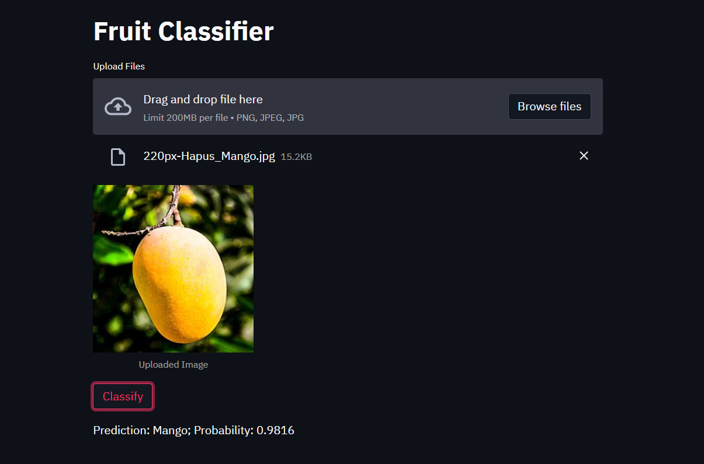
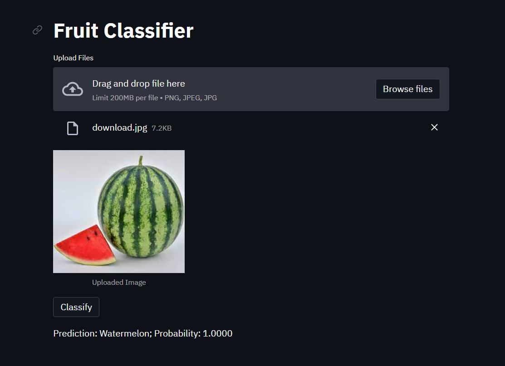
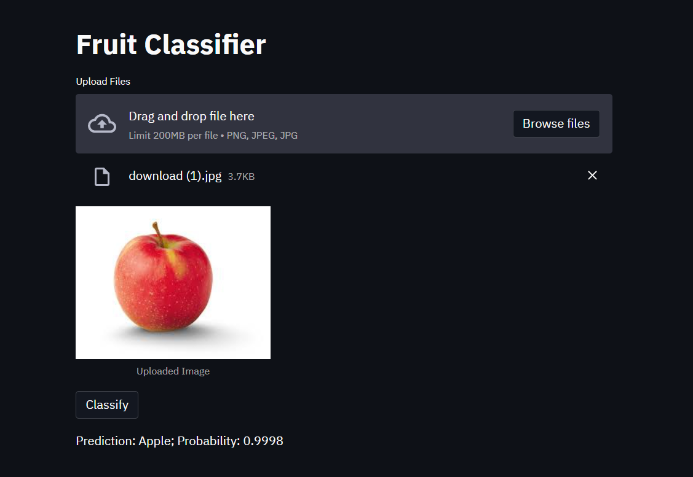

# Fruit Classifier

This is a simple app to classify fruits using [fastai](https://docs.fast.ai/) and [streamlit](https://www.streamlit.io/). The app is deployed using Streamlit Sharing. Click [here](https://share.streamlit.io/narasimhanavpl/fruit-detector/main/fruit_classifier.py) to test it. This project is done for the course digital image processing.

Find the tutorial on how to create your own dog classifier in [this Medium article](https://towardsdatascience.com/how-to-create-an-app-to-classify-dogs-using-fastai-and-streamlit-af3e75f0ee28).

## Overview
### Dataset
1200 different fruit images are obtained using duckduckgo search engine. There are 150 images of each type of fruit. The fruit types it can detect are Apple, Orange, Kiwi, Banana, Mango, Pineapple, Pomegranate and Watermelon. 

## Results
I used some pics off the internet to test the classifier. Some of the results are given below. 

